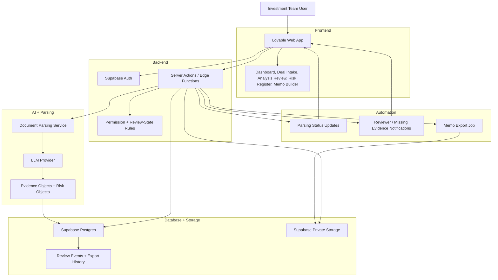

# ARCHITECTURE.md — Blue Torch.me

## 1. System Overview
Blue Torch.me is an enterprise web application for VC, growth equity, and private equity deal review. The system ingests confidential deal materials, extracts structured investment evidence, routes AI-generated objects through human review, and produces investment committee-ready memo exports.

The architecture is built around four requirements:

- Source traceability: every insight links back to source material or an explicit assumption.
- Human review: AI outputs require approval, rejection, edit, or escalation before memo use.
- Confidentiality: uploaded files are private by default and permissioned by organization and deal.
- Repeatable workflow: deal lifecycle, review states, audit history, and exports are persisted.

## 2. High-Level Architecture

Five layers represented:

- Frontend: user-facing product screens and review actions.
- Backend: authentication, permissions, server-side functions, and business rules.
- Database: deal records, evidence objects, review history, and private documents.
- AI: document parsing, LLM classification, evidence extraction, and risk generation.
- Automation: parsing status updates, reviewer notifications, and memo export jobs.

## 3. Frontend
The frontend is a Lovable-generated web app using the design system in `DESIGN.md`.

Core screens:

- Home Dashboard
- Deals List / Deal Pipeline
- New Deal Intake
- Documents
- Analysis Review
- Risk Register
- Diligence Questions
- Investment Memo Builder
- Memo Export Preview
- Team Settings

UI patterns:

- Fixed left navigation
- Top deal context bar
- Dense tables with filters and status chips
- Split panes for review plus source preview
- Citation chips, confidence labels, review-state controls, and export actions

## 4. Backend
The backend uses Supabase plus server-side functions.

Responsibilities:

- Authenticate users and enforce organization/deal permissions
- Store deal metadata and lifecycle state
- Store uploaded documents in private buckets
- Track document parsing status
- Persist AI-generated evidence objects
- Persist review states, comments, lifecycle events, and exports
- Run document parsing and AI calls outside the browser

AI and parsing calls must run server-side so provider keys are never exposed to the client.

Failure handling:

- Upload failure: keep the document row with `Failed` status and visible retry action.
- Parsing failure: show parser error, preserve the original file, and allow reprocessing.
- AI failure: do not create evidence objects; show a reviewable error event.
- Missing citation: block memo insertion until a source or assumption is added.
- Export failure: preserve memo draft and create an export error event.

## 5. Database Model
Recommended Supabase tables:

- `organizations`: firm/account record
- `users`: user profile linked to auth identity
- `memberships`: user role inside an organization
- `deals`: company/deal metadata, lifecycle state, owner, stage, sector
- `documents`: uploaded file metadata, parsing status, storage path
- `evidence_objects`: facts, assumptions, estimates, recommendations, open questions, missing evidence
- `risks`: risk category, severity, confidence, source, mitigation, owner, status
- `diligence_questions`: question, topic, priority, owner, due date, status
- `memo_sections`: memo content by section with approved evidence references
- `comments`: reviewer comments on deals, evidence objects, risks, or memo sections
- `review_events`: audit log for state changes and reviewer actions
- `exports`: generated memo exports and export metadata

Core relationships:

- One organization has many users and deals.
- One deal has many documents, evidence objects, risks, diligence questions, comments, memo sections, review events, and exports.
- Evidence objects and risks reference documents and source locations when available.

## 6. AI Pipeline
1. User uploads deal material.
2. File is stored in a private Supabase Storage bucket.
3. Server function creates a `documents` row with `Uploading` or `Processing` status.
4. Parsing service extracts text, tables, file metadata, and source locations.
5. LLM classifies extracted material into structured objects:
   - Facts
   - Assumptions
   - Estimates
   - Risks
   - Recommendations
   - Open Questions
   - Missing Evidence
6. The system stores each output as a reviewable database object.
7. Analyst reviews each object and sets the review state.
8. Approved objects can be inserted into the memo builder.
9. Memo export preserves citations, confidence labels, and unresolved questions.

Required metadata for every AI-generated insight:

- source citation
- confidence level
- evidence type
- missing information
- reviewer approval state

## 7. States and Permissions
Deal lifecycle states:

- Incoming
- Screening
- Analysis
- Partner Review
- IC Ready
- Invested
- Rejected
- Archived

Review states:

- New
- Needs Review
- Approved
- Rejected
- Escalated
- Superseded

Roles:

- Admin: manage organization, users, permissions, and settings
- Deal Owner: create deals, upload documents, assign reviewers, export memos
- Reviewer: approve, reject, edit, flag, or escalate evidence
- Viewer: read approved deal materials and memo outputs

Row-level security should restrict all deal data by organization membership and deal-level permission.

## 8. Security and Privacy
Security requirements:

- Use Supabase Auth for sign-in.
- Use row-level security on all organization and deal-scoped tables.
- Store uploaded documents in private buckets.
- Keep LLM and parsing API keys server-side.
- Log lifecycle changes and reviewer decisions in `review_events`.
- Do not expose confidential source material in public links.
- Do not allow AI outputs into memo export unless approved or clearly marked unresolved.

AI guardrails:

- Do not fabricate company facts, market data, founder details, financials, benchmarks, citations, metrics, or investment conclusions.
- Do not remove citations or hide uncertainty.
- Do not present legal, tax, accounting, or regulated investment advice.
- Do not approve or reject investments.
- If evidence is incomplete, state the gap and next diligence step.

## 9. Deployment Plan
Target deployment path:

- Frontend: Lovable-hosted web app or exported frontend deployment.
- Backend/database/storage: Supabase project.
- Domain: `bluetorch.me`.
- AI/parsing execution: Lovable server actions or Supabase Edge Functions.

Environment variables needed:

- `SUPABASE_URL`
- `SUPABASE_ANON_KEY`
- `SUPABASE_SERVICE_ROLE_KEY`
- `LLM_API_KEY`
- `DOCUMENT_PARSING_API_KEY`

Service-role keys must only be used in trusted server-side functions.

## 10. MVP Build Sequence
1. Create Supabase schema and row-level security policies.
2. Build auth and organization membership.
3. Build deal dashboard and deal creation.
4. Build private document upload and parsing status.
5. Build evidence object table and review states.
6. Build Analysis Review with source preview.
7. Build Risk Register and Diligence Questions.
8. Build Memo Builder and export preview.
9. Add server-side AI extraction behavior from `AI_BEHAVIOUR.md`.
10. Run end-to-end test from upload to memo export.

## 11. Open Technical Decisions
- Which document types are mandatory for v1: PDF, PPTX, XLSX, DOCX, website URL, or all five.
- Which document parsing provider will be used.
- Which LLM provider will be used.
- Whether SSO is required for v1 or email-domain access is enough.
- Whether memo export must match a specific firm template.
- Whether confidence scores are model-generated, rule-based, reviewer-entered, or combined.
- Whether Investment Committee Debate is v1.5 or part of the first paid pilot.
